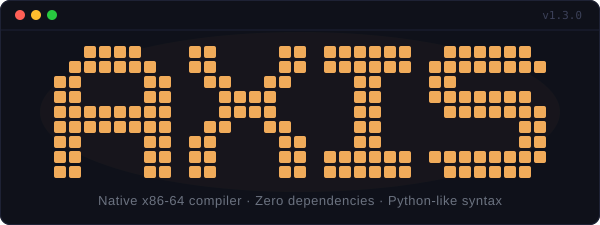
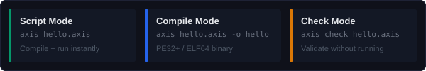

<p align="center">
  
</p>

<p align="center">
  A small programming language with Python-like syntax that compiles to native x86-64 machine code.<br>
  AXIS has two execution modes: <b>script mode</b> for short programs, and <b>compile mode</b> for standalone binaries.<br>
  The compiler (AXCC) is written in C, depends on nothing outside the C standard library, and produces Windows PE and Linux ELF64 executables.
</p>

<p align="center">
  
</p>

## Philosophy

AXIS exists to explore a simple question: *what does a programming language look
like when it is built by one person, from scratch, and deliberately kept small?*

A few values guide the design:

- **Legibility over cleverness.** The syntax is indentation-based and reads the
  way the code behaves. There are no hidden allocations, no implicit coercions,
  and no magic globals.
- **Small surface area.** The language has around three dozen keywords, ten
  primitive types, and a handful of control-flow forms. If a feature doesn't
  earn its place, it isn't added.
- **One tool, no toolchain.** `axis` is a single self-contained binary. It
  lexes, parses, checks, optimises, assembles, and links by itself. There is
  no runtime, no standard library to install, and no build system to configure.
- **Be honest about what it is.** AXIS is a hobby compiler with a narrow scope.
  It is not a production toolchain, it is not a replacement for anything, and
  the benchmarks in [docs/Benchmarks.md](docs/Benchmarks.md) are measurements,
  not marketing.

The project is shared in case parts of it are useful or interesting to others
working in the same space.

## Installation

**Windows** — run the NSIS installer from [Releases](https://github.com/AGDNoob/axis-lang/releases).  
It installs `axis.exe` + `ax` alias and optionally adds AXIS to your PATH.

**Linux / macOS** — one-liner:

```bash
curl -fsSL https://raw.githubusercontent.com/AGDNoob/axis-lang/main/installer/install-linux.sh | bash
```

This clones the repo, compiles AXCC from source (installs `gcc`/`make` if needed), and places the binary in `~/.local/bin/`.

### Building from Source

If you prefer to build manually:

```bash
# Windows (MinGW)
cd axcc
mingw32-make CC=gcc

# Linux / macOS
cd axcc
make CC=gcc
```

This produces `axis.exe` (Windows) or `axis` (Linux).

## Usage

```bash
# Script mode — compile + run immediately
axis hello.axis

# Compile mode — produce a standalone binary
axis hello.axis -o hello            # default format for current OS
axis hello.axis -o hello --pe       # Windows PE
axis hello.axis -o hello --elf      # Linux ELF64

# Check mode — validate without compiling
axis check program.axis             # syntax + semantic errors
axis check program.axis --all       # + dead code + unused variable warnings
```

## Documentation

| Document | Description |
| -------- | ----------- |
| [Guide](docs/guide/) | Learn AXIS step by step |
| [Examples](code/examples/) | 30 example programs |
| [Technical](docs/technical/) | How AXCC works internally |
| [Benchmarks](docs/Benchmarks.md) | Performance measurements |
| [Release Notes](RELEASE_NOTES_v1.3.0.md) | v1.3.0 changes and design philosophy |
| [Changelog](docs/CHANGELOG.md) | Version history |

## License

MIT — see [LICENSE](LICENSE).
