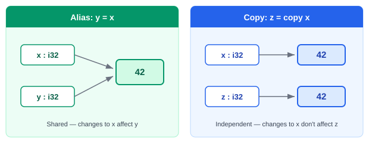

# Variables and Types

## Declaring Variables

Variables are declared with a name, type, and optional initial value:

```axis
x: i32 = 42
name: str = "Alice"
flag: bool = True
```

If you omit the value, the variable is zero-initialized:

```axis
count: i32       # 0
active: bool     # False
```

## Assignment and Aliasing

Variable assignment creates an alias — both names share the same storage:

```axis
x: i32 = 10
y: i32 = x       # alias — y and x share storage
x = 20
writeln(y)       # 20
```

To create an independent copy, use `copy`:

```axis
z: i32 = copy x  # independent copy — changing x does not affect z
```



Array elements cannot be aliased. Accessing an array element in a declaration requires `copy`:

```axis
arr: (i32; 3) = [10, 20, 30]
a: i32 = copy arr[0]    # required — arr[0] cannot be aliased
```

Aliases inherit the constness of their source: a `const` alias of a mutable variable is a compile error.

## Integer Types

AXIS has signed and unsigned integers in 8, 16, 32, and 64-bit widths:

| Type | Size | Range |
| ---- | ---- | ----- |
| `i8` | 8-bit | -128 to 127 |
| `i16` | 16-bit | -32,768 to 32,767 |
| `i32` | 32-bit | -2,147,483,648 to 2,147,483,647 |
| `i64` | 64-bit | -9.2×10¹⁸ to 9.2×10¹⁸ |
| `u8` | 8-bit | 0 to 255 |
| `u16` | 16-bit | 0 to 65,535 |
| `u32` | 32-bit | 0 to 4,294,967,295 |
| `u64` | 64-bit | 0 to 18.4×10¹⁸ |

## Other Types

| Type | Description |
| ---- | ----------- |
| `bool` | `True` or `False` |
| `str` | String |

Strings support concatenation with `+` and comparison with `==` and `!=` in both script and compile mode.

## Type Annotations

Types are always explicit. There is no type inference:

```axis
a: i32 = 10
b: i64 = 1000000
c: u8 = 255
d: bool = True
e: str = "hello"
```

## Constants

Prefix a variable declaration with `const` to make it immutable after initialization:

```axis
const x: i32 = 42
const arr: (i32; 3) = [1, 2, 3]
```

`const` prevents reassignment, compound assignment (`+=`, etc.), index mutation, and passing the variable as an `update` parameter — all are compile errors.

Enums and fields can also be declared `const`:

```axis
const Color: enum:
    Red
    Green
    Blue

const Player: field:
    x: i32
    y: i32
```

`const` variables cannot be assigned from `input()` — this is a compile error.

## Comments

```axis
// C-style comment
# Python-style comment
```

Both styles work everywhere.

## Next

[Control Flow](03-control-flow.md)
