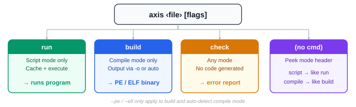
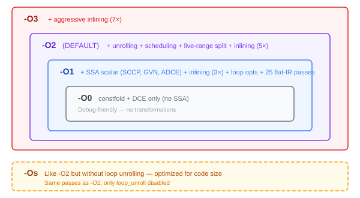
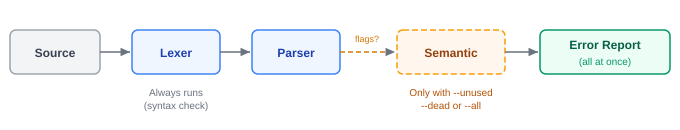

# Command-Line Interface

The AXIS compiler (`axis`) is invoked from the terminal. This chapter covers all subcommands, flags, and options.

---

## Subcommands



### `axis run`

Run a script-mode file. The compiler compiles the file into `__axcache__/` and immediately executes it.

```bash
axis run hello.axis
```

Compile-mode files are rejected — use `build` for those. Format flags (`--pe`, `--elf`) are ignored with a warning.

### `axis build`

Compile a compile-mode file to a standalone binary.

```bash
axis build program.axis -o program
```

Script-mode files are rejected — use `run` for those.

### `axis check`

Validate a source file **without** generating code or running it. The compiler runs the lexer and parser — and optionally the semantic analyzer — then reports all errors at once instead of stopping at the first.

```bash
axis check program.axis --all
```

See [Check Flags](#check-flags) below for the available warning flags.

### `axis help`

Print usage information. Same as `axis -h` or `axis --help`.

### Auto-Detect Mode

If no subcommand is given, the compiler peeks at the `mode` declaration:

- **Script file** → cached in `__axcache__/` and executed (like `run`)
- **Compile file** → compiled to binary (like `build`); prompts for output path if `-o` is not set

```bash
axis hello.axis          # script → runs it
axis program.axis -o out # compile → builds it
```

---

## Output Options

| Flag | Description |
| ---- | ----------- |
| `-o <file>` | Set output file path. Default: input name with `.exe` (Windows) or no extension (Linux). |
| `--pe` | Force output as Windows PE executable. |
| `--elf` | Force output as Linux ELF64 executable. |

`--pe` and `--elf` only apply to `build` and auto-detect compile mode. They are ignored (with a warning) when running scripts.

---

## Optimization Levels

| Flag | Description |
| ---- | ----------- |
| `-O0` | Minimal passes only. Debug-friendly, no SSA. |
| `-O1` | SSA + scalar optimizations + inlining + flat-IR passes. |
| `-O2` | **Default.** Full pipeline: GVN, loop opts, unrolling, scheduling. |
| `-O3` | Like `-O2` with more aggressive inlining thresholds. |
| `-Os` | Like `-O2` but disables loop unrolling — optimizes for code size. |



Default is `-O2`. Optimization only applies to compile-mode files; scripts skip it.

---

## Debug / Dump Flags

| Flag | Description |
| ---- | ----------- |
| `--dump-tokens` | Print the token stream after lexing. |
| `--dump-ir` | Print the IR after optimization. |
| `--dump-x64` | Print x86-64 code generation info. |
| `-v`, `--verbose` | Verbose output — prints stage-by-stage progress and statistics. |

---

## Check Flags

These flags only apply to the `check` subcommand:



| Flag | Description |
| ---- | ----------- |
| `--unused` | Warn about unused local variables. Function parameters don't trigger this. |
| `--dead` | Warn about unreachable code (after `return`, `stop`, `skip`). |
| `--all` | Enable all warnings (`--dead` + `--unused`). |

Without any warning flag, `check` only validates syntax (lexer + parser). Semantic analysis runs when at least one warning flag is present.

### Example: Unreachable Code

```axis
mode compile

func main() -> i32:
    return 0
    writeln("This will never run")    # warning!
```

```bash
axis check program.axis --dead
```

```text
program.axis:5:5: warning: unreachable code after return
```

### Example: Unused Variables

```axis
mode compile

func main() -> i32:
    x: i32 = 42          # warning — never used
    y: i32 = 10
    writeln(y)
    return 0
```

```bash
axis check program.axis --unused
```

```text
program.axis:4:5: warning: unused variable 'x'
```

### Error Collection

In `check` mode, the compiler collects **all** errors and reports them together:

```bash
axis check broken.axis
```

```text
broken.axis:3:5: semantic error: undeclared variable 'x'
broken.axis:7:12: semantic error: type mismatch in assignment
2 errors found
```

This makes `axis check` useful in CI pipelines and editors.

---

## Info Flags

| Flag | Description |
| ---- | ----------- |
| `-h`, `--help` | Show usage help and exit. |
| `--version`, `-V` | Print version (`axis 1.3.0`) and exit. |

---

*This is the last chapter of the AXIS Language Guide.*

← [Compile Mode](11-compile-mode.md)
