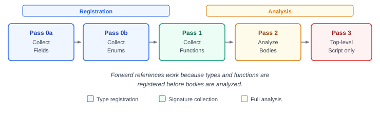

# Semantic Analysis

The semantic analyzer (`semantic.c`) performs type checking, scope analysis, and stack layout calculation across multiple passes.

## Passes

The analyzer runs five passes over the AST:

1. **Pass 0a — Collect field definitions**: Registers all `field` (struct) types in the symbol table so they can be referenced before their definition.
2. **Pass 0b — Collect enum definitions**: Registers all `enum` types, assigns auto-incremented values to variants.
3. **Pass 1 — Collect function signatures**: Records every function's name, parameter types, and return type. This allows functions to call each other regardless of definition order.
4. **Pass 2 — Analyze function bodies**: Full type checking for statements and expressions inside functions.
5. **Pass 3 — Analyze top-level statements** (script mode only): Type checks the top-level code outside of functions.



## Type System

Defined in `axis_common.h`:

| Category | Types |
| --- | --- |
| Void | `void` |
| Boolean | `bool` |
| Signed integers | `i8`, `i16`, `i32`, `i64` |
| Unsigned integers | `u8`, `u16`, `u32`, `u64` |
| Strings | `str` |
| Composite | `array`, `field`, `enum` |

Type sizes: `bool`/`i8`/`u8` = 1 byte, `i16`/`u16` = 2, `i32`/`u32` = 4, `i64`/`u64`/`str` = 8.

## Type Inference

When a variable is declared with `var x = expr`, the analyzer infers the type from the expression:

- Integer literals default to `i64`
- Boolean literals → `bool`
- String literals → `str`
- Expressions inherit their type from operand types

The inferred type is stored on each `ASTExpr` node in the `inferred_type` field.

## Scope Analysis

The analyzer maintains a scoped symbol table as a linked list of scope frames. Each scope has a pointer to its parent scope. Variable lookups walk up the chain.

Per symbol, the table tracks:

- Name and type
- Mutability
- Stack offset (negative from RBP)
- Whether it is a parameter

Loop depth is tracked to validate that `stop` and `skip` only appear inside loops.

## Stack Layout

During analysis, each local variable is assigned a stack offset. Offsets grow downward from RBP:

```text
[rbp - 8]   ← first local
[rbp - 16]  ← second local
...
```

The total stack size is recorded per function and used later by the x64 code generator for the function prologue.

## Next

[IR Generation](05-ir-generation.md)
