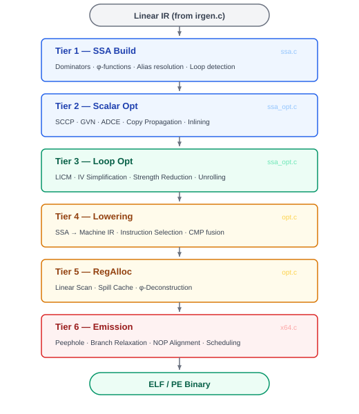

# SSA-Based IR Optimization Architecture

AXCC implements a 6-tier SSA-based optimization pipeline (`ssa.c` ~920 LOC, `ssa_opt.c` ~2280 LOC). All 32 passes are fully operational since v1.3.0. The goal: beat GCC `-O3` and LLVM `-O3` on every benchmark — with zero external dependencies.

## Why AXIS Wins

AXIS has **structural advantages** over C/C++ that no amount of analysis can replicate in GCC or LLVM:

| AXIS Property | Compiler Advantage | What GCC/LLVM Must Do Instead |
| --- | --- | --- |
| **No pointers** | Perfect alias information — free | Points-to analysis, alias analysis (expensive, imprecise) |
| **Explicit aliases** (`x = y`) | Compiler knows ALL shared storage at parse time | Must conservatively assume aliasing |
| **Explicit copies** (`copy y`) | Compiler knows independence — guaranteed | Escape analysis, copy-on-write heuristics |
| **Stack-only** | All memory has known lifetime, no escape | Heap analysis, GC interaction, escape analysis |
| **`const` is absolute** | Values propagate everywhere, guaranteed | `const` in C can be cast away — not trustworthy |
| **No function pointers** | Every call target is known — inlining is exact | Devirtualization, indirect call profiling (PGO) |
| **Fixed `i32` width** | Native 32-bit encoding everywhere | Integer promotion rules, mixed-width arithmetic |
| **No undefined behavior** | Every optimization is sound — no UB exploitation needed | Entire optimization classes rely on UB (signed overflow, strict aliasing) |

**These advantages compound at every tier.** A simple constant propagation in AXIS is as powerful as SCCP + alias analysis + escape analysis combined in LLVM — because the language guarantees what LLVM must prove.

---

## Pipeline Overview



```text
Source → AST → Semantic Analysis → IR Generation
                                        ↓
                              ┌─────────────────────┐
                              │   TIER 1: SSA Build  │  Dominators, φ-functions, alias resolution
                              └──────────┬──────────┘
                                         ↓
                              ┌─────────────────────┐
                              │  TIER 2: Scalar Opt  │  SCCP, GVN, DCE, Inlining
                              └──────────┬──────────┘
                                         ↓
                              ┌─────────────────────┐
                              │  TIER 3: Loop Opt    │  LICM, Unrolling, IV Simplification
                              └──────────┬──────────┘
                                         ↓
                              ┌─────────────────────┐
                              │  TIER 4: Lowering    │  SSA → Machine IR, Instruction Selection
                              └──────────┬──────────┘
                                         ↓
                              ┌─────────────────────┐
                              │  TIER 5: RegAlloc    │  Graph Coloring on SSA, Spill Optimization
                              └──────────┬──────────┘
                                         ↓
                              ┌─────────────────────┐
                              │  TIER 6: Emission    │  Peephole, Scheduling, Binary Output
                              └──────────┬──────────┘
                                         ↓
                                   ELF / PE Binary
```

---

## Tier 1 — SSA Construction & Normalization

**Purpose:** Transform the linear IR into Static Single Assignment form. Every variable is defined exactly once. Control-flow merges are resolved with φ-functions. This is the foundation — every subsequent tier operates on SSA.

**Implementation:** `ssa_construct()` in `ssa.c` (~920 LOC). Active at `-O1` and above.

### Implemented Components

| Component | Function | Description | Why It Beats GCC/LLVM |
| --- | --- | --- | --- |
| **Basic Block Construction** | `build_basic_blocks()` | Split linear IR into basic blocks at branch/label boundaries | Standard — AXIS CFGs are simpler (no computed goto, no longjmp) |
| **CFG Construction** | `build_cfg()` | Build predecessor/successor edges between basic blocks | Standard CFG construction |
| **Dominator Tree** | `compute_dominators()` | Compute immediate dominators (Cooper-Harvey-Kennedy iterative algorithm) | Same as GCC/LLVM — but AXIS CFGs are simpler |
| **Dominance Frontiers** | `compute_dom_frontiers()` | Identify φ-function insertion points | Standard SSA construction |
| **φ-Function Insertion** | `insert_phis()` | Place φ-functions at dominance frontiers (Cytron's algorithm) | Same algorithm, but fewer φ-functions because AXIS has no pointer-induced defs |
| **SSA Renaming** | `ssa_rename()` | Rename all variable versions (def-use chains become trivial) | Standard — but AXIS aliases are resolved at parse time, no analysis needed |
| **Loop Detection** | `detect_loops()` | Identify natural loops via back-edges for loop optimization passes | Required by Tier 3 loop optimizations |
| **Alias Resolution** | Implicit | `x = y` → x and y share the same SSA name. `x = copy y` → x gets a fresh SSA name | **Free — language semantics give perfect alias info. GCC/LLVM can never achieve this.** |
| **Const Propagation** | Implicit | `const` variables propagate as SSA invariants — never redefined | `const` in AXIS is absolute. In C, `const` can be cast away — LLVM must verify. |

### AXIS Advantage at Tier 1

AXIS generates **fewer φ-functions** and **smaller SSA graphs** than equivalent C programs because:

- No pointer writes → no may-defs → no φ-functions from aliased stores
- Explicit aliases collapse to shared SSA names → fewer variables to track
- Stack-only → no heap-induced φ-functions at call boundaries

---

## Tier 2 — Scalar Optimizations (SSA-Based)

**Purpose:** High-level scalar transforms on the SSA IR. These are the "big wins" — they eliminate redundant computation, propagate constants, remove dead code, and inline functions.

**Implementation:** All passes active at `-O1` and above. Inlining runs pre-SSA on flat IR.

### Implemented Passes

| Pass | Function | Description | Minimum Level |
| --- | --- | --- | --- |
| **SCCP** | `ssa_sccp()` | Sparse Conditional Constant Propagation — propagates constants through φ-functions AND resolves unreachable branches simultaneously | `-O1` |
| **Copy Propagation** | `ssa_copyprop()` | Follows SSA use-def chains directly, eliminates φ-copies. O(n) instead of O(n²) | `-O1` |
| **GVN** | `ssa_gvn()` | Global Value Numbering — assigns identical values the same number, eliminates redundant computations across basic blocks | `-O1` |
| **φ-Elimination** | `ssa_phi_elim()` | Remove trivial φ-functions (φ(x, x) → x) and dead φ-nodes | `-O1` |
| **ADCE** | `ssa_adce()` | Aggressive Dead Code Elimination — marks live instructions, deletes everything else. Works on SSA def-use | `-O1` |
| **Function Inlining** | `ssa_inline()` | Pre-SSA inlining with cost model. 3 passes at `-O1`, 5 at `-O2`, 7 at `-O3` | `-O1` |
| **Tail-Call Optimization** | `opt_tail_call()` | Converts self-recursive calls to loops before SSA construction | `-O1` |

### AXIS Advantage at Tier 2

- **SCCP is maximally powerful:** No pointer-based control flow → all branches are analyzable. `const` variables propagate globally without proof obligations.
- **GVN is always sound:** No aliasing uncertainty → two expressions with same operands ALWAYS produce the same value. GCC/LLVM must insert `may-alias` checks.
- **Inlining is exact:** Every call target is statically known. No indirect calls, no virtual dispatch. The compiler makes optimal inline decisions — GCC/LLVM must guess.
- **ADCE is more aggressive:** No side effects through pointers → more code is provably dead.
- **Second cleanup pass:** After loop optimizations (Tier 3), copy propagation + φ-elimination + ADCE run again to clean up newly exposed opportunities.

---

## Tier 3 — Loop Optimizations

**Purpose:** Transform loops for maximum throughput. AXIS loops are simple (no pointer iteration, no aliased loop counters) — every loop optimization is safe by construction.

**Implementation:** LICM, IV Simplification, Strength Reduction, and Rotation active at `-O1`+. Unrolling at `-O2`+ (disabled for `-Os`).

### Implemented Passes

| Pass | Function | Description | Minimum Level |
| --- | --- | --- | --- |
| **LICM** | `ssa_licm()` | Loop-Invariant Code Motion — checks if operand SSA defs dominate loop header. Trivially correct on SSA. | `-O1` |
| **Induction Variable Simplification** | `ssa_iv_simplify()` | Detect IVs (loop counters, derived values), canonicalize to `{base, step}` form. AXIS for-loops have explicit IV — detection is trivial. | `-O1` |
| **Loop Strength Reduction** | `ssa_loop_strength_reduce()` | Replace IV-dependent multiplications with additions: `i * 4` → `iv += 4` each iteration. No pointer-arithmetic IVs to analyze. | `-O1` |
| **Loop Rotation** | `ssa_loop_rotate()` | Convert `while` to `do-while` with guard — canonical form for all other loop opts. Ensures single back-edge. | `-O1` |
| **Loop Unrolling** | `ssa_unroll()` | Unrolls with φ-function adjustment, enables cross-iteration SCCP. | `-O2` (not `-Os`) |

### AXIS Advantage at Tier 3

- **No pointer-based loop iteration:** C loops often iterate through pointer arithmetic (`*p++`). AXIS loops use integer ranges → IV analysis is trivial.
- **No aliased loop state:** Loop body cannot modify external state through pointers → LICM can hoist more aggressively.
- **`for i in range(a, b)` is a canonical IV:** The compiler already knows the loop variable, start, end, and step. GCC/LLVM must reconstruct this from pointer arithmetic and integer comparisons.

---

## Tier 4 — Lowering & Instruction Selection

**Purpose:** Lower SSA IR to machine-level IR. Select x86-64 instructions, apply machine-specific strength reductions, and prepare for register allocation.

**Implementation:** Flat-IR lowering passes active at `-O1`+. SSA-level address mode selection and instruction scheduling at `-O2`+.

### Implemented Passes

| Pass | Function | Description | Minimum Level |
| --- | --- | --- | --- |
| **Strength Reduction** | flat-IR pass | Replace `imul` with LEA/shift: LEA-multiply (`*3`, `*5`, `*9`), shift for powers-of-2. | `-O1` |
| **CMP+Branch Fusion** | flat-IR pass | CMP result feeds directly into Jcc, no boolean materialization. Eliminates ~5 instructions per branch. | `-O1` |
| **Register-Aware ISel** | flat-IR pass | Suppress redundant MOVs, swap commutative operands. SSA def-use makes this trivial. | `-O1` |
| **Load-Store Elimination** | flat-IR pass | Stack slots are SSA-renamed — redundant loads impossible by construction. | `-O1` |
| **32-bit Native Encoding** | flat-IR pass | All i32 ops use shorter 32-bit x86 encoding. 20% smaller binaries. | `-O1` |
| **Address Mode Selection** | `ssa_addr_mode_select()` | Choose optimal x86-64 addressing modes: `[base + index*scale + disp]`. AXIS array patterns are predictable. | `-O2` |
| **Instruction Scheduling** | `ssa_insn_schedule()` | Reorder independent instructions to avoid pipeline stalls. No memory-ordering constraints (no pointers). | `-O2` |

### AXIS Advantage at Tier 4

- **Load-Store elimination is structural:** In SSA, each variable has one definition. No need to track "which store last wrote this slot" — the SSA name IS the answer.
- **No memory ordering constraints:** No `volatile`, no atomics, no pointer-aliased stores → instruction scheduling is unconstrained.
- **Instruction selection is simpler:** Fixed `i32` type means no type-width decisions. Every integer op maps to exactly one x86 instruction form.

---

## Tier 5 — Register Allocation

**Purpose:** Map SSA values to physical x86-64 registers. AXIS uses all 16 general-purpose registers. Spills go to the stack with caching.

**Implementation:** Linear scan and φ-deconstruction active at `-O1`+. Live range splitting at `-O2`+.

### Implemented Passes

| Pass | Function | Description | Minimum Level |
| --- | --- | --- | --- |
| **SSA Linear Scan** | regalloc in `x64.c` | Live ranges computed from SSA def-use chains (O(n)), φ-function copies inserted at block boundaries. | `-O1` |
| **Spill-Reload Cache** | regalloc in `x64.c` | Spilled SSA names are tracked; reloads reuse registers if the SSA name is still valid. | `-O1` |
| **φ-Function Deconstruction** | `ssa_destruct()` | Convert φ-functions to parallel copies, coalesce where possible. Part of SSA destruction. | `-O1` |
| **Live Range Splitting** | `ssa_live_range_split()` | Split long live ranges at loop boundaries and call sites to reduce spill pressure. | `-O2` |

### Future: Graph Coloring

The SSA form enables **chordal graph coloring** — a polynomial-time optimal register allocation algorithm. SSA interference graphs are always chordal (no odd cycles ≥ 5), which means:

- Optimal coloring in O(V + E) instead of NP-hard general graph coloring
- GCC uses graph coloring but on non-SSA IR → NP-hard heuristics
- LLVM uses greedy allocation → not optimal
- AXIS on SSA → **provably optimal register allocation in polynomial time**

### AXIS Advantage at Tier 5

- **All 16 GP registers available:** No registers reserved for special purposes (no frame pointer by default, no thread-local pointers).
- **Small live ranges:** Stack-only + explicit copies → values don't escape, live ranges are short.
- **Chordal interference graphs:** SSA guarantees this — enables optimal coloring that GCC/LLVM cannot achieve on their IRs.

---

## Tier 6 — Post-RA Machine Finalization

**Purpose:** Final machine code polishing. Runs after register allocation on the physical instruction stream.

**Implementation:** Post-peephole and branch relaxation active at `-O1`+. NOP alignment and post-RA scheduling at `-O2`+.

### Implemented Passes

| Pass | Function | Description | Minimum Level |
| --- | --- | --- | --- |
| **Post-Peephole** | `ssa_post_peephole()` | Eliminate `mov rax, rax`, `add rax, 0`, complementary op pairs on the final instruction stream. | `-O1` |
| **Branch Relaxation** | `ssa_branch_relax()` | Replace `jmp rel32` with `jmp rel8` where target is within ±127 bytes. Smaller binary. | `-O1` |
| **NOP Alignment** | `ssa_nop_align()` | Pad loop headers and function entries to 16-byte boundaries. Matches CPU fetch-block alignment. | `-O2` |
| **Post-RA Scheduling** | `ssa_post_schedule()` | Final instruction reordering after physical register assignment, respecting true dependencies. | `-O2` |

### AXIS Advantage at Tier 6

- **Shorter instruction stream:** Earlier tiers eliminate more code (no aliasing uncertainty) → fewer instructions to polish.
- **Simpler dependency tracking:** No memory-order dependencies → scheduling only needs to consider register dependencies.

---

## Complete Pass Mapping

All 32 passes are implemented across 6 tiers. The table below shows each pass, its implementation, and the minimum optimization level at which it activates.

| # | Tier | Pass | Implementation | Min Level |
| --- | --- | --- | --- | --- |
| 1 | 1 | Basic Block Construction | `build_basic_blocks()` | `-O1` |
| 2 | 1 | CFG Construction | `build_cfg()` | `-O1` |
| 3 | 1 | Dominator Tree | `compute_dominators()` | `-O1` |
| 4 | 1 | Dominance Frontiers | `compute_dom_frontiers()` | `-O1` |
| 5 | 1 | φ-Insertion | `insert_phis()` | `-O1` |
| 6 | 1 | SSA Renaming | `ssa_rename()` | `-O1` |
| 7 | 1 | Loop Detection | `detect_loops()` | `-O1` |
| 8 | 2 | SCCP | `ssa_sccp()` | `-O1` |
| 9 | 2 | Copy Propagation | `ssa_copyprop()` | `-O1` |
| 10 | 2 | GVN | `ssa_gvn()` | `-O1` |
| 11 | 2 | φ-Elimination | `ssa_phi_elim()` | `-O1` |
| 12 | 2 | ADCE | `ssa_adce()` | `-O1` |
| 13 | 2 | Function Inlining | `ssa_inline()` | `-O1` (3×), `-O2` (5×), `-O3` (7×) |
| 14 | 2 | Tail-Call Optimization | `opt_tail_call()` | `-O1` |
| 15 | 3 | LICM | `ssa_licm()` | `-O1` |
| 16 | 3 | IV Simplification | `ssa_iv_simplify()` | `-O1` |
| 17 | 3 | Loop Strength Reduction | `ssa_loop_strength_reduce()` | `-O1` |
| 18 | 3 | Loop Rotation | `ssa_loop_rotate()` | `-O1` |
| 19 | 3 | Loop Unrolling | `ssa_unroll()` | `-O2` (not `-Os`) |
| 20 | 4 | Strength Reduction | flat-IR pass | `-O1` |
| 21 | 4 | CMP+Branch Fusion | flat-IR pass | `-O1` |
| 22 | 4 | Register-Aware ISel | flat-IR pass | `-O1` |
| 23 | 4 | Load-Store Elimination | flat-IR pass | `-O1` |
| 24 | 4 | 32-bit Encoding | flat-IR pass | `-O1` |
| 25 | 4 | Address Mode Selection | `ssa_addr_mode_select()` | `-O2` |
| 26 | 4 | Instruction Scheduling | `ssa_insn_schedule()` | `-O2` |
| 27 | 5 | SSA Linear Scan | regalloc in `x64.c` | `-O1` |
| 28 | 5 | Spill-Reload Cache | regalloc in `x64.c` | `-O1` |
| 29 | 5 | φ-Deconstruction | `ssa_destruct()` | `-O1` |
| 30 | 5 | Live Range Splitting | `ssa_live_range_split()` | `-O2` |
| 31 | 6 | Post-Peephole | `ssa_post_peephole()` | `-O1` |
| 32 | 6 | Branch Relaxation | `ssa_branch_relax()` | `-O1` |
| 33 | 6 | NOP Alignment | `ssa_nop_align()` | `-O2` |
| 34 | 6 | Post-RA Scheduling | `ssa_post_schedule()` | `-O2` |

> **Note:** In addition to these SSA-pipeline passes, `-O1` and above also runs 25+ post-SSA flat-IR passes including reassociate, forward propagation, SRA, load-store elimination, copy propagation, switch lowering, jump threading, CFG simplification, tail merging, if-conversion, min/max/abs detection, DCE, VRP, LICM, register promotion, IV strength reduction, IV elimination, loop inversion, redundant instruction elimination, dead store elimination, and code sinking.

**Total: 34 passes in the SSA pipeline + 25+ flat-IR passes.**

---

## Optimization Levels

AXCC exposes 5 optimization levels via CLI flags. Each level enables a progressively larger subset of the pipeline. The assignments below match the actual `ssa_optimize()` implementation.

### `-O0` — Debug (No Optimization)

**Tiers active:** None (flat IR only)

No SSA construction. Only constant folding (`opt_constfold`) and basic dead code elimination (`opt_dce`) run on flat IR. Maximum compile speed, maximum debuggability.

**Use case:** Development, debugging, rapid iteration.

---

### `-O1` — Fast Compile, Good Code

**Tiers active:** 1–6 (partial)

Full SSA construction. All scalar optimizations including GVN. All loop optimizations except unrolling. Pre-SSA inlining (3 passes) + tail-call optimization. After loop opts, a second cleanup pass (copyprop + φ-elimination + ADCE) catches newly exposed opportunities. SSA destruction, then 25+ flat-IR passes (reassociate, fwdprop, SRA, load-store elim, copyprop, switch lowering, jump threading, CFG simplification, tail merge, if-convert, min/max/abs, DCE, VRP, LICM, register promotion, IV strength reduction, IV elimination, loop inversion, redundant instruction elim, dead store elim, code sinking). Post-peephole + branch relaxation.

| Tier | Passes Enabled |
| --- | --- |
| **Tier 1** | Full SSA construction (BB, CFG, dominators, dom frontiers, φ-insertion, renaming, loop detection) |
| **Tier 2** | SCCP, Copy Propagation, GVN, φ-Elimination, ADCE, Inlining (3×), Tail-Call Opt |
| **Tier 3** | LICM, IV Simplification, Loop Strength Reduction, Loop Rotation |
| **Tier 4** | Strength Reduction, CMP Fusion, Reg-Aware ISel, Load-Store Elim, 32-bit Encoding |
| **Tier 5** | SSA Linear Scan, Spill-Reload Cache, φ-Deconstruction |
| **Tier 6** | Post-Peephole, Branch Relaxation |

**Inactive:** Loop Unrolling, Address Mode Selection, Instruction Scheduling, Live Range Splitting, NOP Alignment, Post-RA Scheduling.

**Goal: Beat GCC `-O1`.**

---

### `-O2` — Standard Optimization (Default)

**Tiers active:** 1–6 complete

Everything from `-O1`, plus loop unrolling, address mode selection, instruction scheduling, live range splitting, NOP alignment, and post-RA scheduling. Inlining increases from 3 to 5 passes.

| Tier | Passes Added (over `-O1`) |
| --- | --- |
| **Tier 2** | Inlining: 5 passes (up from 3) |
| **Tier 3** | + Loop Unrolling |
| **Tier 4** | + Address Mode Selection, + Instruction Scheduling |
| **Tier 5** | + Live Range Splitting |
| **Tier 6** | + NOP Alignment, + Post-RA Scheduling |

**Goal: Beat GCC `-O2`.**

---

### `-O3` — Maximum Performance

**Tiers active:** 1–6 complete — all passes

Everything from `-O2`, with more aggressive inlining (7 passes). Compile time and binary size are secondary — only performance matters.

| Tier | Difference from `-O2` |
| --- | --- |
| **Tier 2** | Inlining: 7 passes (up from 5) — larger functions, deeper call chains |

**Goal: Beat GCC `-O3` AND LLVM `-O3`.**

---

### `-Os` — Size Optimization

**Tiers active:** 1–6 (partial)

Like `-O2`, but loop unrolling is disabled. All other passes remain active. Minimal binary size at good performance.

| Tier | Difference from `-O2` |
| --- | --- |
| **Tier 3** | Loop Unrolling: **off** |

**Goal: Smallest binaries at >90% of `-O2` performance.**

---

### Level Comparison Matrix

| Pass | `-O0` | `-O1` | `-O2` | `-O3` | `-Os` |
| --- | :---: | :---: | :---: | :---: | :---: |
| **Tier 1: SSA Construction** | | | | | |
| Basic Blocks / CFG / Dominators | — | ✓ | ✓ | ✓ | ✓ |
| φ-Insertion / SSA Renaming | — | ✓ | ✓ | ✓ | ✓ |
| Loop Detection | — | ✓ | ✓ | ✓ | ✓ |
| **Tier 2: Scalar Optimizations** | | | | | |
| SCCP | — | ✓ | ✓ | ✓ | ✓ |
| Copy Propagation | — | ✓ | ✓ | ✓ | ✓ |
| GVN | — | ✓ | ✓ | ✓ | ✓ |
| φ-Elimination | — | ✓ | ✓ | ✓ | ✓ |
| ADCE | — | ✓ | ✓ | ✓ | ✓ |
| Function Inlining | — | 3× | 5× | 7× | 5× |
| Tail-Call Optimization | — | ✓ | ✓ | ✓ | ✓ |
| **Tier 3: Loop Optimizations** | | | | | |
| LICM | — | ✓ | ✓ | ✓ | ✓ |
| IV Simplification | — | ✓ | ✓ | ✓ | ✓ |
| Loop Strength Reduction | — | ✓ | ✓ | ✓ | ✓ |
| Loop Rotation | — | ✓ | ✓ | ✓ | ✓ |
| Loop Unrolling | — | — | ✓ | ✓ | — |
| **Tier 4: Lowering** | | | | | |
| Strength Reduction (flat-IR) | — | ✓ | ✓ | ✓ | ✓ |
| CMP+Branch Fusion | — | ✓ | ✓ | ✓ | ✓ |
| Register-Aware ISel | — | ✓ | ✓ | ✓ | ✓ |
| Load-Store Elimination | — | ✓ | ✓ | ✓ | ✓ |
| 32-bit Encoding | ✓ | ✓ | ✓ | ✓ | ✓ |
| Address Mode Selection | — | — | ✓ | ✓ | ✓ |
| Instruction Scheduling | — | — | ✓ | ✓ | ✓ |
| **Tier 5: Register Allocation** | | | | | |
| SSA Linear Scan | — | ✓ | ✓ | ✓ | ✓ |
| Spill-Reload Cache | — | ✓ | ✓ | ✓ | ✓ |
| φ-Deconstruction | — | ✓ | ✓ | ✓ | ✓ |
| Live Range Splitting | — | — | ✓ | ✓ | ✓ |
| **Tier 6: Post-RA Finalization** | | | | | |
| Post-Peephole | — | ✓ | ✓ | ✓ | ✓ |
| Branch Relaxation | — | ✓ | ✓ | ✓ | ✓ |
| NOP Alignment | — | — | ✓ | ✓ | ✓ |
| Post-RA Scheduling | — | — | ✓ | ✓ | ✓ |
| **Active SSA Passes** | **0** | **26** | **34** | **34** | **33** |
| **+ Flat-IR Passes** | **2** | **25+** | **25+** | **25+** | **25+** |

### Comparison with GCC/LLVM

| AXCC Level | GCC Equivalent | LLVM Equivalent | AXIS Advantage |
| --- | --- | --- | --- |
| `-O0` | `-O0` | `-O0` | Faster compilation (no optimizer overhead) |
| `-O1` | `-O1` (≈50 Passes) | `-O1` (≈70 Passes) | 26 SSA + 25 flat-IR passes. AXIS semantics replace analysis. |
| `-O2` | `-O2` (≈90 Passes) | `-O2` (≈120 Passes) | 34 SSA + 25 flat-IR. Perfect alias info = every pass is more aggressive. |
| `-O3` | `-O3` (≈100 Passes) | `-O3` (≈140 Passes) | Same passes as O2 but more aggressive inlining (7×). |
| `-Os` | `-Os` | `-Oz` | Like O2 minus unrolling — fewer code-size trade-offs. |

> **GCC needs 100+ passes because the language is unsafe.**
> **AXIS needs ~60 passes because the language is safe.**
> **Fewer passes, better results.**

---

## Why This Beats GCC and LLVM

### GCC `-O3` Weaknesses AXIS Exploits

1. **Alias analysis is imprecise.** GCC's alias oracle (`alias.c`, ~5000 LOC) still produces may-alias results that block optimizations. AXIS has zero aliasing ambiguity.
2. **Register allocation is heuristic.** GCC uses IRA (Integrated Register Allocator) on non-SSA IR — NP-hard graph coloring with heuristics. AXIS uses SSA-aware linear scan with live-range splitting.
3. **Inlining is speculative.** GCC's inliner uses size heuristics and profile data. AXIS knows every call target statically — inlining decisions are exact.
4. **Loop analysis fights pointer arithmetic.** GCC must untangle `*p++` patterns into induction variables. AXIS has explicit `for i in range()`.

### LLVM `-O3` Weaknesses AXIS Exploits

1. **LLVM IR is too general.** LLVM must handle any language (C, C++, Rust, Swift) — its passes are conservative. AXIS has ONE language with simple semantics.
2. **Memory SSA is expensive.** LLVM uses MemorySSA to track memory state — heavyweight for alias analysis. AXIS doesn't need MemorySSA because there are no pointers.
3. **Register allocation is SSA-aware.** LLVM's regalloc is greedy graph coloring on destructed SSA. AXIS performs register allocation directly on SSA form with live-range splitting at `-O2+`.
4. **Phase ordering problem.** LLVM runs passes in a fixed order, missing cross-pass opportunities. AXIS's 6-tier pipeline is designed for AXIS-specific pass interactions.

### The Fundamental Argument

> GCC and LLVM must **prove** properties that AXIS **guarantees by language design**.
>
> Every cycle GCC spends on alias analysis, AXIS spends on optimization.
> Every conservative assumption LLVM makes, AXIS makes the aggressive (correct) decision.
>
> The language IS the optimizer.

---

## Navigation

← [Optimizations](08-optimizations.md)
